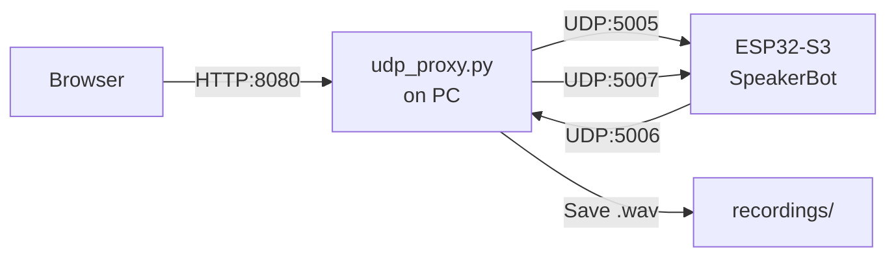

# 🔊 SpeakerBot — Project Overview

Complete MicroPython project for an ESP32-S3 voice-enabled static robot created in [SpeakerBot/](file:///c:/Users/Mna/Documents/PythonCursBalls/MojQuadraped/SpeakerBot).

## Files Created (11 total)

### ESP32 Files (upload to board)
| File | Purpose | Lines |
|------|---------|-------|
| [main.py](file:///c:/Users/Mna/Documents/PythonCursBalls/MojQuadraped/SpeakerBot/main.py) | Clean entry point — imports & calls only | ~70 |
| [config.py](file:///c:/Users/Mna/Documents/PythonCursBalls/MojQuadraped/SpeakerBot/config.py) | All pin assignments & constants | ~75 |
| [wifi.py](file:///c:/Users/Mna/Documents/PythonCursBalls/MojQuadraped/SpeakerBot/wifi.py) | WiFi connection manager | ~55 |
| [servo.py](file:///c:/Users/Mna/Documents/PythonCursBalls/MojQuadraped/SpeakerBot/servo.py) | Head servo with smooth movement, nod/shake | ~125 |
| [display.py](file:///c:/Users/Mna/Documents/PythonCursBalls/MojQuadraped/SpeakerBot/display.py) | 0.91" OLED: text faces, audio level bars | ~155 |
| [audio.py](file:///c:/Users/Mna/Documents/PythonCursBalls/MojQuadraped/SpeakerBot/audio.py) | I2S mic (INMP441) + speaker (MAX98357A) | ~210 |
| [bot.py](file:///c:/Users/Mna/Documents/PythonCursBalls/MojQuadraped/SpeakerBot/bot.py) | High-level orchestrator | ~170 |
| [udp_server.py](file:///c:/Users/Mna/Documents/PythonCursBalls/MojQuadraped/SpeakerBot/udp_server.py) | UDP cmd server + audio streaming | ~195 |

### PC Files (run on computer)
| File | Purpose |
|------|---------|
| [udp_proxy.py](file:///c:/Users/Mna/Documents/PythonCursBalls/MojQuadraped/SpeakerBot/udp_proxy.py) | HTTP↔UDP proxy + audio recording/playback |
| [web_controller.html](file:///c:/Users/Mna/Documents/PythonCursBalls/MojQuadraped/SpeakerBot/web_controller.html) | Web control interface |

### Documentation
| File | Purpose |
|------|---------|
| [README.md](file:///c:/Users/Mna/Documents/PythonCursBalls/MojQuadraped/SpeakerBot/README.md) | Full docs, pinout, wiring, commands |

---

## ESP32-S3 Pin Map

```
GPIO 1  → Servo PWM (Head)
GPIO 5  → INMP441 SCK (I2S clock)
GPIO 6  → INMP441 WS  (word select)
GPIO 7  → INMP441 SD  (data out)
GPIO 8  → OLED SDA    (I2C data)
GPIO 9  → OLED SCL    (I2C clock)
GPIO 15 → MAX98357 BCLK
GPIO 16 → MAX98357 LRC
GPIO 17 → MAX98357 DIN
```

## Audio Format Decision

| Direction | Format | Rationale |
|-----------|--------|-----------|
| Mic → PC | **Raw PCM** (16-bit, 16kHz, mono) | Zero overhead, lowest latency for UDP streaming |
| PC → Bot | **WAV** (16-bit, 16kHz, mono) | Self-describing, trivially parseable, no codec needed. MP3 requires a decoder that MicroPython can't handle. |

## UDP Ports

| Port | Direction | Content |
|------|-----------|---------|
| 5005 | PC → ESP32 | Text commands |
| 5006 | ESP32 → PC | Raw PCM mic audio |
| 5007 | PC → ESP32 | WAV file chunks |

## Architecture



> [!IMPORTANT]
> Before uploading, edit [config.py](file:///c:/Users/Mna/Documents/PythonCursBalls/MojQuadraped/servo_config.py) to set `WIFI_SSID`, `WIFI_PASS`, and `PC_IP`.
> Also install the `ssd1306` driver: `mpremote mip install ssd1306`
